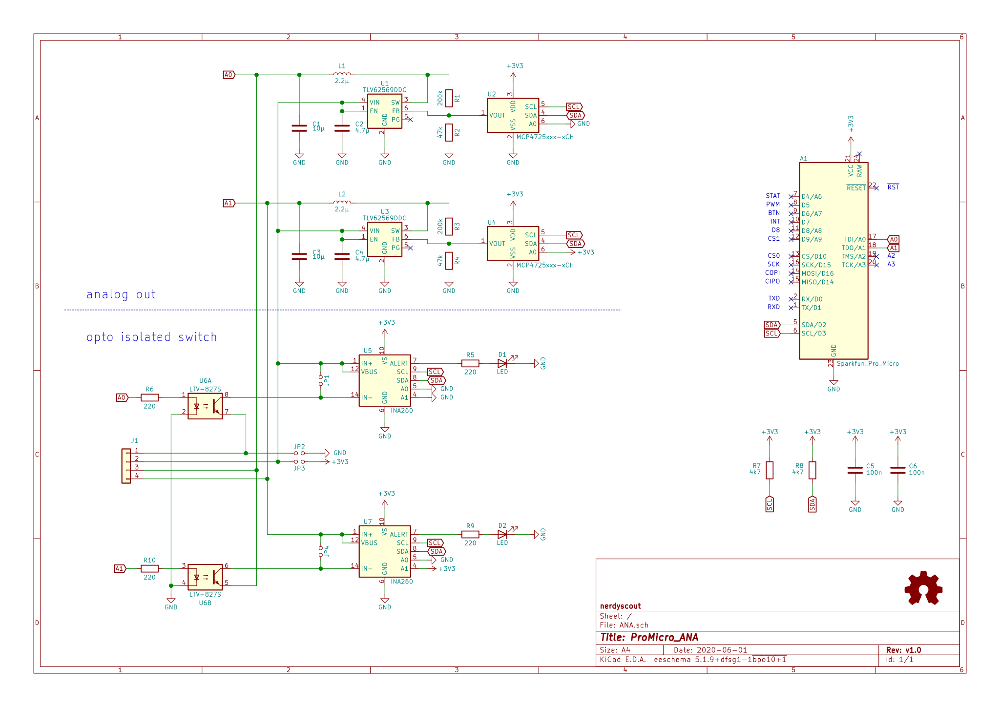

# ProMicro_ANA 
This module can be mounted, back on back, to any [Arduino Pro Mini](https://www.sparkfun.com/products/11113), [Arduino Nano](https://store.arduino.cc/arduino-nano) or [Sparkfun Pro Micro](https://www.sparkfun.com/products/12587) running with 3.3V. 

## Documentation 
All files can be found on [Github](https://github.com/nerdyscout/ProMicro/tree/master/ANA).

### Schematic

### BoM
  * [interactiveHTMLBoM](https://nerdyscout.github.io/ProMicro/ANA/docs/bom/ANA-ibom.html)
  * [octopart](docs/bom/ANA-bom_octopart.csv)

## Hardware 
### Layout

### Gerbers
can be found within the Github [repository](gerbers).

## Code  (unless otherwise stated)
  * [tbd](examples/tbd/tbd.ino)

## external
### Links
  * [hackaday.io](https://hackaday.io/project/171898-promicro)
