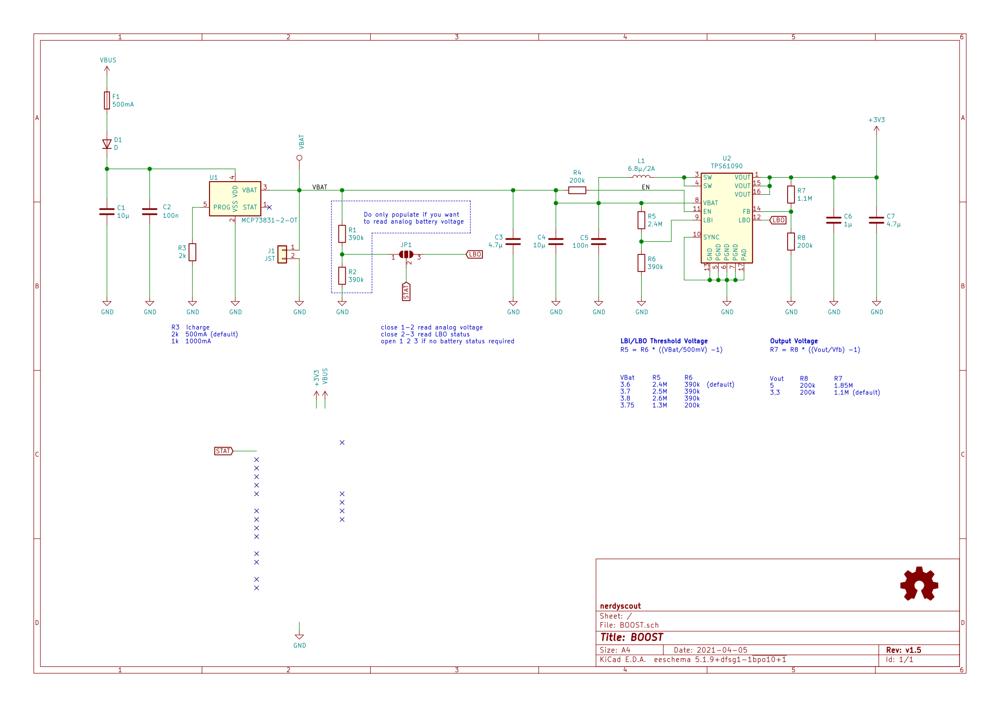

# ProMicro_BOOST 
This module can be mounted, back on back, to any [Arduino Pro Mini](https://www.sparkfun.com/products/11113), [Arduino Nano](https://store.arduino.cc/arduino-nano) or [Sparkfun Pro Micro](https://www.sparkfun.com/products/12587) running with 3.3V. While the controller gets externally powered the BOOST battery is charging, removing the cable the device keeps running on battery.

## Documentation 
All files can be found on [Github](https://github.com/nerdyscout/ProMicro/tree/master/BOOST).

### Schematic

### BoM
  * [interactiveHTMLBoM](https://nerdyscout.github.io/ProMicro/BOOST/docs/bom/BOOST-ibom.html)
  * [bom.csv](gerbers/BOOST-bom.csv)

## Hardware 
### Layout

### Gerbers
can be found within the Github [repository](gerbers).

## Code 
  * [readAnalog](examples/readAnalog.ino/readAnalog.ino)

## external
### Links
  * [oshwa.org](https://certification.oshwa.org/de000102.html)
  * [hackaday.io](https://hackaday.io/project/171898-promicro)

### Credits
  * [Adafruit PowerBoost 500 Basic](https://learn.adafruit.com/adafruit-powerboost)
