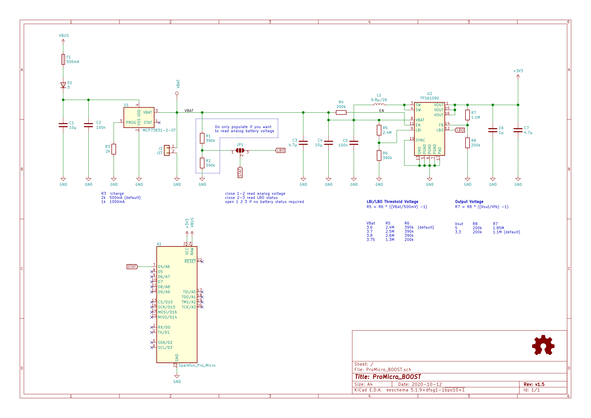

# ProMicro_BOOST
This module can be mounted, back on back, to any [Arduino Pro Mini](https://www.sparkfun.com/products/11113), [Arduino Nano](https://store.arduino.cc/arduino-nano) or [Sparkfun Pro Micro](https://www.sparkfun.com/products/12587) running with 3.3V. While the controller gets externally powered the BOOST battery is charging, removing the cable the device keeps running on battery.

## Documentation
All files can be found on [Github](https://github.com/nerdyscout/ProMicro/tree/master/BOOST).

### Schematic

### Layout

### BoM
  * [interactiveHTMLBoM](https://nerdyscout.github.io/ProMicro/BOOST/docs/bom/ProMicro_BOOST-ibom.html)
  * [csv](docs/bom/ProMicro_BOOST-bom_octopart.csv

## Gerbers
can be found within the Github [repository](gerbers).

## Code
  * [Arduino Micro 3V3](examples/Arduino_Micro_BOOST/Arduino_Micro_BOOST.ino)
  * [Arduino Nano 3V3](examples/Arduino_Nano_BOOST/Arduino_Nano_BOOST.ino)
  * [Sparkfun Pro Micro 3V3](examples/Sparkfun_ProMicro_BOOST/Sparkfun_ProMicro_BOOST.ino)

## Links
  * [hackaday.io](https://hackaday.io/project/171898-promicro)

## Credits
  * [Adafruit PowerBoost 500 Basic](https://learn.adafruit.com/adafruit-powerboost)

## License
Copyright Stefan Herold 2020

This documentation describes Open Hardware and is licensed under the CERN OHL v.1.2.

You may redistribute and modify this documentation under the terms of the CERN OHL v.1.2. (http://ohwr.org/cernohl). This documentation is distributed WITHOUT ANY EXPRESS OR IMPLIED WARRANTY, INCLUDING OF MERCHANTABILITY, SATISFACTORY QUALITY AND FITNESS FOR A PARTICULAR PURPOSE. Please see the CERN OHL v.1.2 for applicable conditions
