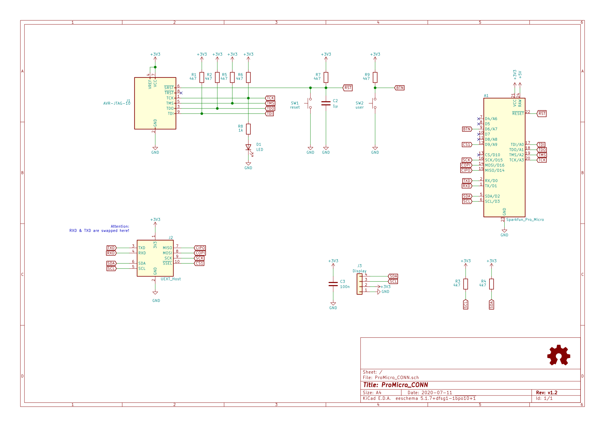

# ProMicro_CONN
This module can be mounted to an [Arduino Pro Mini](https://www.sparkfun.com/products/11113), [Arduino Nano](https://store.arduino.cc/arduino-nano), [Sparkfun Pro Micro](https://www.sparkfun.com/products/12587), or any other pincompatible MCU running with 3.3V. You could connect a 0.91" OLED Display and a UEXT connector for more modules, alternatively a JTAG socket is available.

## Documentation
All files can be found on [Github](https://github.com/nerdyscout/ProMicro/tree/master/CONN).

### Schematic

### Layout

### BoM
  * [interactiveHTMLBoM](https://nerdyscout.github.io/ProMicro/CONN/docs/bom/ProMicro_CONN-ibom.html)
  * [octopart.csv](docs/bom/ProMicro_CONN-bom_octopart.csv)
  * [jlcpcb.csv](gerbers/ProMicro_CONN-bom_jlcpcb.csv)

## Gerbers
can be found within the Github [repository](gerbers).

## Code
| | CONN |
| --- | --- |
| Arduino Nano | tbd |
| Sparkfun ProMicro | [CONN](examples/Sparkfun_ProMicro_CONN/Sparkfun_ProMicro_CONN.ino) |

## Links
  * [hackaday.io](https://hackaday.io/project/171898-promicro)

## License
Copyright Stefan Herold 2020

This documentation describes Open Hardware and is licensed under the CERN OHL v.1.2.

You may redistribute and modify this documentation under the terms of the CERN OHL v.1.2. (http://ohwr.org/cernohl). This documentation is distributed WITHOUT ANY EXPRESS OR IMPLIED WARRANTY, INCLUDING OF MERCHANTABILITY, SATISFACTORY QUALITY AND FITNESS FOR A PARTICULAR PURPOSE. Please see the CERN OHL v.1.2 for applicable conditions
