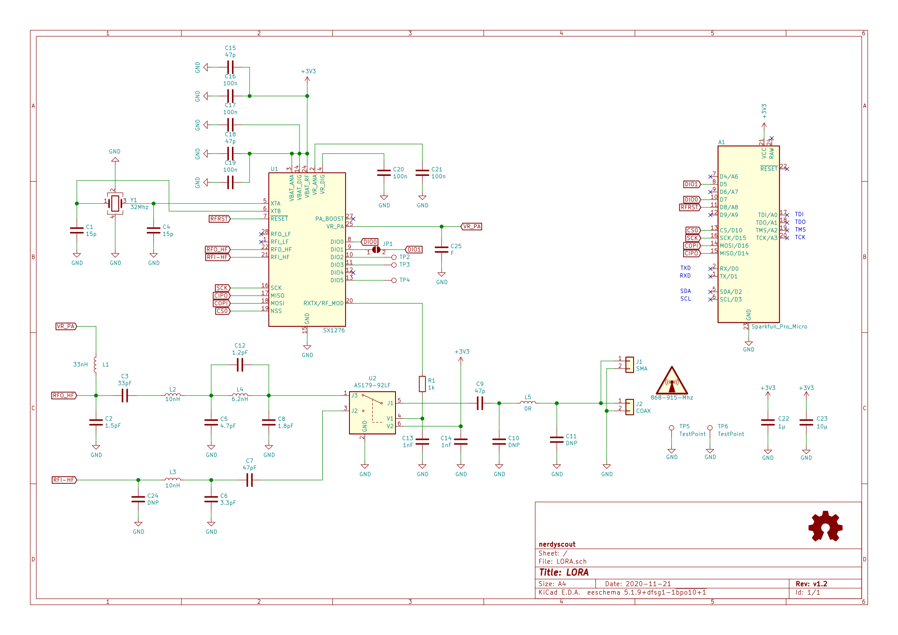

:warning:
PCB currently not working! most likely some issue in the HF circuit.

# ProMicro_LORA 
This module can be mounted to an [Arduino Pro Mini](https://www.sparkfun.com/products/11113), [Arduino Nano](https://store.arduino.cc/arduino-nano), [Sparkfun Pro Micro](https://www.sparkfun.com/products/12587), or any other pincompatible MCU running with 3.3V. Manufacturing this PCB with 0.8mm thickness allows to mount a GPS module onto its back.

## Documentation 
All files can be found on [Github](https://github.com/nerdyscout/ProMicro/tree/master/LORA).

### Schematic

### Layout

### BoM
  * [interactiveHTMLBoM](https://nerdyscout.github.io/ProMicro/LORA/docs/bom/LORA-ibom.html)
  * [bom.csv](gerbers/LORA-bom.csv)

## Hardware 
### Layout

## Gerbers
can be found within the Github [repository](gerbers).

## Code 
| | LORA | 
| --- | --- |
| Arduino Nano | [SX1276](examples/Arduino_Nano_LORA/Arduino_Nano_LORA.ino) |
| Sparkfun ProMicro | [SX1276](examples/Sparkfun_LORA/Sparkfun_LORA.ino) |

## external
### Links
  * [hackaday.io](https://hackaday.io/project/171898-promicro)
