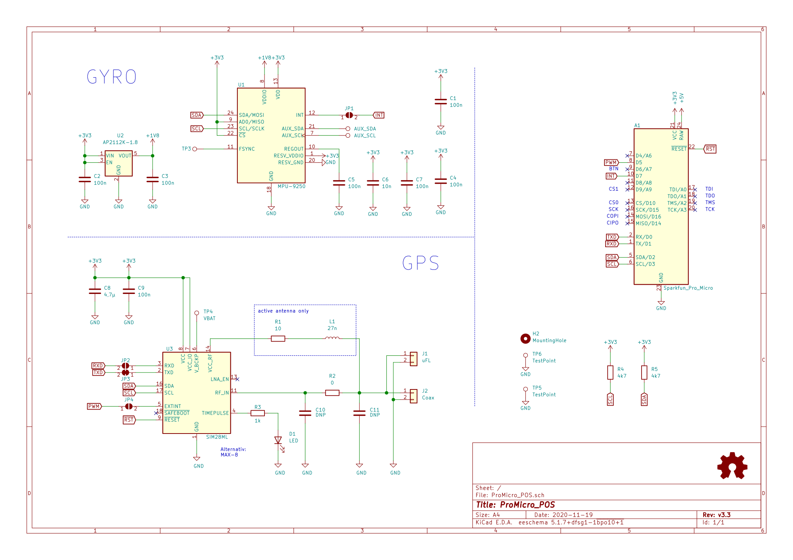

# ProMicro_POS 
This module can be mounted to an [Arduino Pro Mini](https://www.sparkfun.com/products/11113), [Arduino Nano](https://store.arduino.cc/arduino-nano), [Sparkfun Pro Micro](https://www.sparkfun.com/products/12587), or any other pincompatible MCU running with 3.3V. Depending on assembly it provides GPS and/or GYRO data. Manufacturing this PCB with 0.8mm thickness allows to mount a [LORA](../LORA) module onto its back.

## Documentation 
All files can be found on [Github](https://github.com/nerdyscout/ProMicro/tree/master/POS).

### Schematic

### BoM
  * [interactiveHTMLBoM](https://nerdyscout.github.io/ProMicro/POS/docs/bom/ProMicro_POS-ibom.html)
  * [octopart.csv](docs/bom/ProMicro_POS-bom_octopart.csv)
  * [jlcpcb.csv](gerbers/ProMicro_POS-bom_jlcpcb.csv)

## Hardware 
### Layout

### Gerbers
can be found within the Github [repository](gerbers).

## Code 
  * GPS
    * [Arduino Nano](examples/Arduino_Nano_GPS/Arduino_Nano_GPS.ino)
    * [Sparkfun ProMicro](examples/Sparkfun_ProMicro_GPS/Sparkfun_ProMicro_GPS.ino)
  * GYRO
    * [ICM20948](examples/Sparkfun_ProMicro_ICM20948/Sparkfun_ProMicro_ICM20948.ino)
    * [MPU9250](examples/Sparkfun_ProMicro_MPU9250/Sparkfun_ProMicro_MPU9250.ino)

## external
### Links
  * [hackaday.io](https://hackaday.io/project/171898-promicro)
